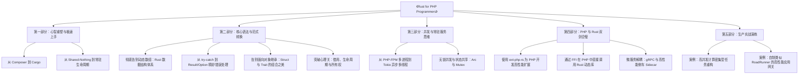

# 实施计划：《Rust for PHP Programmers》书籍与教程编写方案

## 项目目标与可行性评估

### 1. 可行性结论：高度可行，且市场需求与价值巨大
编写一份面向 PHP 程序员的 Rust 教程（《Rust for PHP Programmers》）**不仅完全可行，而且具有非常强烈的现实痛点和生态价值**：

- **痛点与技术升级诉求**：很多资深 PHP 开发者（Laravel/Symfony 生态、高并发微服务、常驻内存框架如 Swoole/RoadRunner）在面对高并发、高性能计算、低延迟网络协议、音视频流媒体处理、AI 本地推理服务时，常常面临性能瓶颈或多进程常驻内存泄漏问题。
- **生态融合契机**：
  - PHP 扩展开发过去依赖编写晦涩容易内存溢出的 C/C++（Zend API），而现在官方生态有成熟的 **[ext-php-rs](https://github.com/davidcole1340/ext-php-rs)**，允许纯 Rust 开发安全高效的 PHP 原生扩展。
  - 常驻进程高并发服务器（如 [RoadRunner](https://roadrunner.dev/)、FrankenPHP 等机制）让 PHP 程序员对长期运行的进程模型有了基本认知，过渡到 Rust 异步运行时（Tokio）更顺畅。
- **差异化优势**：微软官方已有 C/C++、C#、Python 的迁移指南，但唯独缺少专门针对 **Web/服务端核心语言 PHP** 的视角。PHP 开发者具备很强工程实战经验，但在“静态强类型”、“内存生命周期管理”、“多线程共享状态”上存在明显的心智断层，一本针对性极强的指南可以精准击中痛点。

---

## 核心心智映射表（Mental Model Bridge）

为了让 PHP 程序员顺畅理解 Rust，全书将围绕以下核心心智模型对比展开：

| 领域 / 概念 | PHP（PHP 8+） | Rust | 转换关键点 / 避坑提示 |
| :--- | :--- | :--- | :--- |
| **执行模型** | 经典 Shared-Nothing，单请求生命周期，请求结束销毁一切 | 单一长期运行进程，共享内存 / 消息传递并发 | 习惯了“请求结束内存自动回收”会转为“必须清晰定义对象何时释放” |
| **类型系统** | 动态弱类型 + 逐步类型（渐进式类型声明） | 编译期强静态类型 + 全局类型推导 | 无运行时隐式转换，无隐式 `null` / `undefined` |
| **空值与异常** | `null`、`try/catch`、`Throwable` | `Option<T>`、`Result<T, E>`、`?` 操作符 | 将异常视为主流程控制转向为“显式处理所有可能失败的情况” |
| **内存与所有权** | Zend GC（引用计数 + 循环垃圾收集器） | 所有权系统（Move 语义 + 借用检查 Borrow Checker） | 彻底摆脱 GC，编译期保证无悬垂指针、无数据竞争 |
| **面向对象 vs 特征** | `class`、`extends` 单继承、`interface`、`trait` | `struct`、`enum`（带数据）、`impl`、`trait` | 摆脱继承心智，拥抱组装（Composition）与面向数据设计（DOD） |
| **数据结构** | 万能散列表 `array`（关联数组兼列表） | 定长数组、动态列表 `Vec<T>`、哈希表 `HashMap<K, V>` | 告别一个 `array` 走天下，学会按内存布局挑选具体结构 |
| **依赖与包管理** | `Composer`、`composer.json`、`Packagist` | `Cargo`、`Cargo.toml`、`crates.io` | 心智高度相似，易上手；注意编译产物与静态链接机制 |
| **扩展与嵌入** | C 语言 Zend API / FFI | `ext-php-rs` 编写安全扩展 / C-ABI FFI 互调 | 用 Rust 替代手写 C 编写高性能扩展 |

---

## 书籍大纲与目录规划

### 详细章节设计：

#### **第一部分：心智重塑（The Mindset Shift）**
1. **PHP 程序员为什么需要 Rust？**
   - PHP 的天花板（计算密集、并发常驻、系统编程、内存开销）。
   - Rust 带来的确定性（零运行时开销、内存安全、并发安全）。
2. **环境搭建与工具链直观对比**
   - `composer` vs `cargo`（依赖解析、版本规范、构建生命周期）。
   - `php.ini` vs `Cargo.toml` / `rust-toolchain.toml`。
   - `php -S` vs `cargo run` / `cargo watch`。
3. **彻底抛弃 Shared-Nothing 心智**
   - PHP-FPM 模式下的“无忧内存管理”带来的假象。
   - 常驻内存世界（Swoole / RoadRunner 到 Rust 进程）的核心规则。

#### **第二部分：语言核心与对齐（Syntax & Semantics Alignment）**
4. **类型系统的蜕变**
   - 强类型 vs PHP 8 的渐进类型（Union Types, Match 表达式等对比）。
   - 告别万能 `array`：什么时候用 `Vec<T>`、`HashMap<K, V>`、`BTreeMap`？
5. **没有 Class，如何建模？**
   - Struct + Impl 的数据与行为分离。
   - PHP Trait vs Rust Trait：名同实不同的特征约束与多态。
   - 强类型枚举（Algebraic Data Types）：比 PHP Enum 强大百倍的代数枚举。
6. **优雅地处理可能发生的错误**
   - 为什么 Rust 没有 `try/catch` 和 `null`？
   - `Option<T>` 与 PHP `?Type` 的差异。
   - `Result<T, E>`、`?` 语法糖与工业级错误链库（`thiserror` / `anyhow`）。
7. **攻克 Rust 最硬的核：所有权与借用检查（The Borrow Checker）**
   - 用 PHP 引用计数（zval / refcount）原理解读 Rust 编译期静态分析。
   - 移动（Move）与复制（Copy）。
   - 不变引用（`&`）与可变引用（`&mut`）的排他性规则（读写锁原则）。

#### **第三部分：并发与高性能服务（Concurrency & Runtime）**
8. **从多进程（Fork/FPM）到异步多线程**
   - PHP-FPM / Swoole 协程对比 Rust 原生线程与 Tokio 异步运行时。
   - 任务（Task）与并发调度模型。
9. **跨线程状态共享与通信**
   - 不再依赖 Redis 做跨请求状态中转：内存级共享。
   - `Arc<Mutex<T>>` 与 `RwLock<T>`。
   - 消息传递机制（Channel: mpsc/broadcast）。

#### **第四部分：PHP 与 Rust 协同实战（PHP & Rust Interop）**
10. **编写 PHP 原生扩展的新姿势：`ext-php-rs`**
    - 告别难懂的 C 语言与 Zend Macro 陷阱。
    - 用纯 Rust 导出函数、类与方法给 PHP 调用。
11. **通过 FFI（外部函数接口）跨语言调用**
    - 编译 Rust 为 `.so` / `.dll` C-ABI 动态库。
    - 在 PHP 中通过 `FFI::cdef()` 高速调用 Rust 逻辑。
12. **微服务与 Sidecar 架构**
    - PHP 负责敏捷业务交付（CRUD、后台）。
    - Rust 负责高性能网关、长连接推送（WebSocket）、图片视频编解码、Token 生成计算。

#### **第五部分：工程化与部署交付（Production Engineering）**
13. **单元测试、基准测试与性能剖析**
    - `PHPUnit` vs `cargo test`。
    - 基准测试工具 `criterion`。
14. **容器化构建与发布**
    - 多阶段构建（Multi-stage Dockerfile）：生成只有几 MB 的 Alpine/Scratch 静态二进制镜像。
    - CI/CD 自动发布流程。

---

## 实施路线图

1. **第 1 阶段：样章与框架搭建（1-2 周）**
   - 选型文档生成工具（推荐与微软系列一致的 **mdBook**）。
   - 完成前言、第一章（工具链对比）与核心心智模型章节（PHP 程序员视角的引用与所有权解析）。
2. **第 2 阶段：核心语法对比与示例库开发（2-3 周）**
   - 编写配对代码示例（每个知识点同时给出 PHP 8.x 实现与对应的 idiomatic Rust 实现）。
   - 搭建配套 GitHub 仓库（`rust-for-php-programmers`）。
3. **第 3 阶段：生态互操作与实战案例（2 周）**
   - 制作 `ext-php-rs` 的端到端示例教程（例如：在 PHP 中调用 Rust 实现的高性能敏感词过滤算法）。
4. **第 4 阶段：审校与开源发布**
   - 部署至 GitHub Pages（参考 `https://<your-org>.github.io/rust-for-php-programmers`）。
   - 在社区（V2EX、知乎、PHP中文网、掘金、Reddit r/rust 等）发布反馈并持续迭代。

---

## 关键待确认事项（Open Questions）

> [!IMPORTANT]
> 1. **受众定位**：本指南主要侧重于**完全迁移到 Rust 做后端开发**，还是侧重于**PHP + Rust 协同（编写扩展/Sidecar/微服务）**？（建议：两者兼顾，先过渡再协同）。
> 2. **展示形态**：是否按照类似微软的开源电子书（基于 Rust 原生 `mdBook` + GitHub Pages）的形式进行组织？
> 3. **下一步执行**：是否需要现在立即帮您初始化该项目的 `mdBook` 骨架、配置目录并写出前两章样章草稿？
