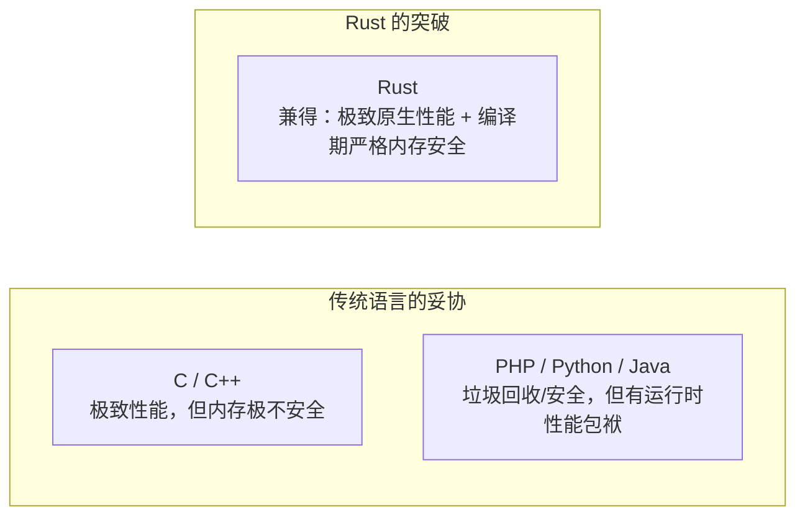

# 01. 动机与破局：为什么 PHP 开发者需要学习 Rust？

> “PHP 是世界上最好的 Web 胶水语言，而 Rust 是这个时代最强大的系统级基石。”

作为一名资深 PHP 工程师，你可能已经熟练掌握了 Laravel、Symfony，搭建过无数套高可用 Web API，甚至在 Swoole、Workerman 或 RoadRunner 上跑过常驻内存的长连接服务。

你可能会问：**“PHP 8 已经有了 JIT，语法也越来越现代化，我为什么还要耗费心力去学习以陡峭学习曲线著称的 Rust？”**

本章将直击这个核心问题，剖析 PHP 在架构演进中的现实瓶颈，以及 Rust 能够为你带来的降维打击能力。

---

## 1. PHP 带来的生产力红利与隐形天花板

PHP 之所以能在过去的几十年中统治互联网服务端，归功于其核心的 **Shared-Nothing（无共享状态）** 哲学：
- 每一个 HTTP 请求进来，PHP-FPM 为其分配一个独立进程；
- 请求结束，该请求申请的全部变量、内存与资源**瞬间被 Zend 引擎整体重置和回收**。

这种设计使得 PHP 拥有极高的**容错能力**——即使某个请求中出现了轻微的内存泄漏或未捕获的异常，也绝不会污染其他请求，更不会导致整个系统崩溃。

### 然而，天花板在以下场景显现：

1. **极端 CPU 密集型任务**：
   - 图像/视频处理与转码；
   - 复杂的大型 JSON / Protobuf 序列化与反序列化；
   - 本地 AI 模型权重推理、嵌入向量（Embedding）距离计算；
   - 敏感词树匹配（Aho-Corasick）、加密解密算法。
   在这些场景中，即使开启了 OPcache 和 JIT，PHP 运行时的对象封装与类型检查开销依然会导致 CPU 迅速飙到 100%。

2. **常驻内存（Long-Running Processes）的心智折磨**：
   - 现代 PHP 框架（如 Swoole / RoadRunner）为了追求数万 QPS，打破了传统的 Shared-Nothing 模式，改为常驻内存。
   - 这立刻将 PHP 开发者推入了它最不擅长的领域：**静态变量内存泄漏**、**全局连接池悬垂**、**协程间的未加锁数据竞争**。PHP 没有从语言层面保护你免受这些问题的困扰。

3. **传统 C 扩展开发的绝望**：
   - 历史上解决 PHP 性能瓶颈的“终极武器”是编写 C 扩展（Zend Extension）。
   - 但任何写过 Zend C API 的工程师都知道，那是极其危险的体验：手动的引用计数增减（`Z_TRY_ADDREF`）、原始裸指针操作、内存未释放或野指针会直接引发系统崩溃（`Segmentation Fault: 11`），直接导致整个集群被拖垮。

---

## 2. Rust 的核心承诺：零成本抽象与绝对确定性

Rust 是由 Mozilla 发起、并在近几年被微软、Google、Linux 内核全面接纳的系统级编程语言。它提供了一套在过去被认为“鱼和熊掌不可兼得”的特性：

### Rust 带来的四大核心破局点：

1. **绝对的性能与零运行时开销（Zero-Cost Abstractions）**：
   - Rust 没有垃圾回收器（No GC），没有虚拟机，编译产物是直接运行在 CPU 上的高度优化的机器码。
   - 它的抽象（泛型、Trait、迭代器）在编译期就会被单态化与内联展开，高级写法的运行速度与手写汇编无异。

2. **“如果能编译通过，它就是内存安全的”（Memory Safety without GC）**：
   - Rust 创造性地引入了 **所有权（Ownership）与借用检查（Borrow Checker）**。
   - 编译器在编译期跟踪每一个变量的生命周期：杜绝悬垂指针、杜绝双重释放、杜绝空指针异常（No Null Pointer Exception）。

3. **无畏并发（Fearless Concurrency）**：
   - 在多线程环境下，变量能不能跨线程传递？能不能跨线程共享？
   - Rust 的类型系统（`Send` 与 `Sync` Trait）在编译期把关。如果存在数据竞争（Data Race），代码根本无法通过编译！

4. **对 PHP 极度友好的互操作生态（`ext-php-rs`）**：
   - 你不再需要写痛苦的 C 语言。使用现代的 `ext-php-rs` 库，你可以用 100% 优雅安全的 Rust 代码直接写出 PHP 扩展。
   - 编译器替你排查一切内存陷阱，产出的扩展模块既稳定如磐石，又具备原生极致速度。

---

## 3. 何时该引入 Rust？PHP 与 Rust 的协作定位

学习 Rust 并不意味着要用 Rust 重写现有的整个 PHP 业务！聪明的架构师懂得发挥各自所长：

| 维度 | PHP 的战场 | Rust 的战场 |
| :--- | :--- | :--- |
| **业务特点** | 敏捷迭代的 Web 业务逻辑、CRUD、后台管理、快速试错 | 底层计算密集型模块、基础中间件、常驻进程引擎、API 网关 |
| **开发重心** | 交付速度、灵活热更、完善的生态库 | 确定性、内存安全、高吞吐低延迟、零 GC 抖动 |
| **协同方式** | 主调方：负责承接用户 HTTP 流量与业务调度 | 受调方：作为 PHP 原生扩展、本地动态库（FFI）或独立 gRPC 侧车 |

---

## 本章小结

- PHP 的优点在于敏捷与隔离，但在高并发常驻、计算密集与系统级底层开发上存在局限。
- Rust 为我们带来了现代系统级开发的终极解法：无 GC 的原生性能与编译期强制的内存安全。
- 掌握 Rust，不仅能让你获得构建现代基础软件的能力，还能反哺你的 PHP 架构体系，构建“PHP 敏捷 + Rust 高性能”的无敌技术底座。

接下来，在 **[02. 快速起步：Composer 与 Cargo 的双重视角](ch02-getting-started.md)** 中，我们将带你对比两个语言的包管理与构建工具，在 5 分钟内编写并运行你的第一个 Rust 程序！
