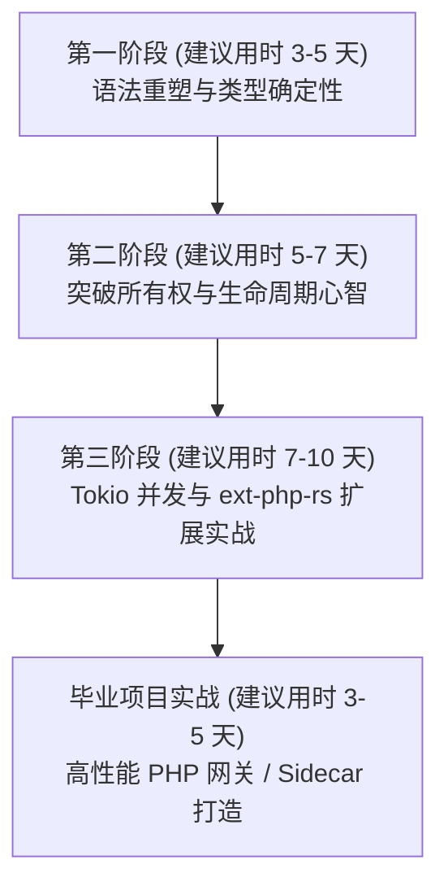

# 前言：写给 PHP 开发者的 Rust 进阶指南

欢迎来到 **《Rust for PHP Programmers》**。

这是一本专为拥有 **PHP 8+ / Laravel / Symfony / Workerman / Webman / Swoole / RoadRunner** 背景的开发者量身打造的 Rust 系统级编程指南。全书深度参考了微软官方培训教程（*Bridge 系列*）的工业级知识体系，针对动态弱类型、单请求生命周期（Shared-Nothing）以及垃圾回收机制的思维定势，提供系统化、渐进式的重塑方案。

---

## 为什么写这本书？

过去二十年里，PHP 统治了全球 Web 开发的大半江山。它凭借极低的心智门槛、飞速的敏捷交付能力以及“单请求即销毁（Shared-Nothing）”带来的内存容错性，支撑了海量的互联网业务。

然而，随着微服务架构、实时流媒体、低延迟网关、密集数据序列化以及本地 AI 推理等场景的普及，纯 PHP 架构开始面临明显的**天花板**：
1. **CPU 密集型计算瓶颈**：尽管 PHP 8 引入了 JIT，但其动态类型特性和对象模型依然带来较高的运行时开销；
2. **多进程常驻内存的挑战**：在 Workerman、Webman、Swoole 或 RoadRunner 等常驻内存框架中，虽然并发 QPS 获得了巨大提升，但全局静态变量内存泄漏、单进程内阻塞调用拖垮事件循环、难以排查的内存膨胀是困扰无数团队的噩梦；
3. **扩展开发的门槛与风险**：传统的 PHP 原生扩展必须使用 C/C++ 配合复杂的 Zend API 编写，指针越界、悬垂引用极易导致整个 PHP-FPM / Workerman 工作进程崩溃或段错误（Segmentation Fault）。

**Rust 正是破局的最佳利器。** 它拥有媲美 C/C++ 的极致性能与零成本抽象，同时通过编译器借用检查机制在编译期彻底杜绝了内存安全漏洞与数据竞争。

更令人兴奋的是，Rust 与 PHP 并非“二选一”的替代关系，而是**天作之合**：
- 你可以用纯 Rust 编写出内存安全、运行飞快的 **PHP 原生扩展**（借助现代的 `ext-php-rs` 工具链）；
- 你可以用 Rust 打造高性能的 **Sidecar / 应用网关 / 任务调度器**，与现有的 Workerman / Webman / Laravel 架构无缝协同，而业务敏捷层依然使用熟悉的 PHP 进行交付。

---

## 学习路线与节奏建议（Pacing Guide）

本书分为三个进阶部分，共 17 个核心章节。我们建议您按照以下节奏展开自学或团队内部分享：

| 阶段 | 涵盖章节 | 核心学习目标 | 检验标志（Checkpoint） |
| :--- | :--- | :--- | :--- |
| **第一阶段** | 第 01 ~ 06 章 | 熟悉工具链，建立静态强类型心智，告别万能 Array | 能用 Cargo 独立构建一个带枚举和模式匹配的命令行小工具 |
| **第二阶段** | 第 07 ~ 12 章 | **核心突破**：攻克所有权、生命周期、Trait 与错误处理 | 能向同事清晰解释为什么 `let s2 = s1;` 会让 `s1` 失效，以及与 PHP 引用计数的区别 |
| **第三阶段** | 第 13 ~ 17 章 | Tokio 异步并发、`ext-php-rs` 扩展开发、架构迁移与毕业项目 | 能用 Rust 为现有的 PHP 项目编写一个高性能原生扩展模块并上线运行 |

### 详细时间规划参考表

1. **第一阶段：语法重塑与类型确定性（第 01 ~ 06 章，建议用时 3-5 天）**
   - 从 `composer` 到 `cargo`，搭建现代工具链；
   - 习惯不可变绑定 `let`，告别弱类型隐式转换；
   - **痛点转换**：告别万能 `array`，理解连续内存布局的 `Vec<T>`、`HashMap` 与切片；
   - 掌握带数据的高级 `enum` 与穷尽模式匹配 `match`，彻底消灭空指针异常。

2. **第二阶段：突破最硬核心智关（第 07 ~ 12 章，建议用时 5-7 天）**
   - **重点攻坚**：以 PHP 底层 `zval` 引用计数与 Zend GC 为对照，深度理解 Rust 零成本 Move 语义；
   - 掌握借用检查（Borrow Checker）与“读写互斥法则”，理解为什么 Rust 能在编译期杜绝数据竞争；
   - 学习 PSR-4 与 Rust 模块树映射、显式类型转换契约（`From/Into`）以及链式惰性迭代器。

3. **第三阶段：高并发与生态互通（第 13 ~ 17 章，建议用时 7-10 天）**
   - **并发演进**：对比 PHP-FPM 多进程与 Workerman/Swoole 事件循环，深入 Rust 原生线程与 Tokio 异步运行时；
   - **杀手级实战**：使用 `ext-php-rs` 编写纯 Rust 原生 PHP 扩展，并在 PHP 8 中调用运行；
   - **架构落地**：渐进式重构现有 Laravel / Webman / Workerman 项目的慢路径，打造毕业项目。

---

## 约定与阅读说明

- **双语代码对照**：书中涉及的关键概念，会同时提供 **PHP 8.x 实现** 与 **Idiomatic Rust 实现** 的左右/上下对比，帮助您快速找到对应的技术映射。
- **避坑警示**：书中带有 `> [!WARNING]` 或 `> [!IMPORTANT]` 标识的段落，均是 PHP 开发者初学 Rust 时最容易踩坑的思维误区（如试图在 Rust 中使用类继承、滥用全局状态等）。

准备好开启这段突破舒适圈、重塑系统级工程思维的旅程了吗？让我们从第一章开始！
